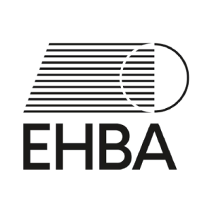

## REGLES 2018
### Révision 200324
>- Traduction de la version équivalente en anglais.
>- En cas de litige, se référer à EHBA et au document en version originale.
>- _Traduction mars 2020 : Quentin Bouchard_
>- _Relecture et correction : Jean-François Jolfre, Théo Jeanneau, Laurent Trichereau, Antoine  Guerand, Julien Chol_
>- _Validation EHBA : Alejandro Carrillo_
___
## Table des matières

- [Section 1 : Équipes, joueurs et équipements](Section_1.md)
- [Section 2 : Installations de jeu](Section_2.md)
- [Figures – Crease et lignes principales](Section_2.5.md)
- [Section 3 : Officiels](Section_3.md)
- [Section 4 : Action sur la balle](Section_4.md)
- [Section 5 : Déroulement du jeu](Section_5.md)
- [Section 6 : Fautes](Section_6.md)
- [Section 7 : Pénalités](Section_7.md)
- [Section 8 : Procédure de pénalité](Section_8.md)
 
